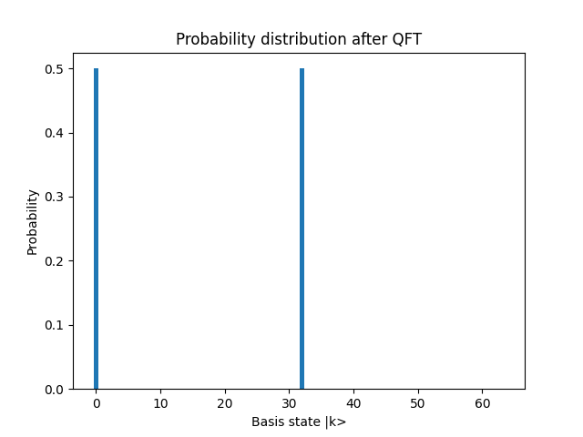
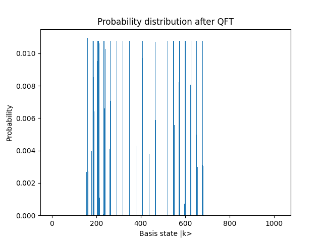
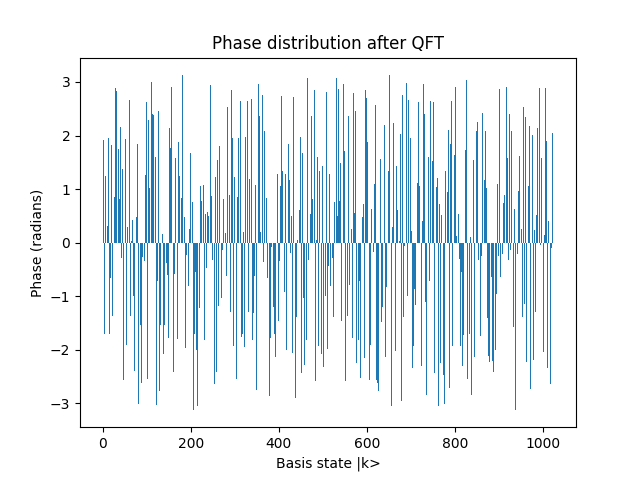

# quantum-computing-stuff
#### Repository for testing and experimenting with Pennylane.
### Quantum Fourier Transform 

Assuming $n$ qubits, creating a superposition:
```math

|\psi\rangle = \frac{1}{\sqrt{2^n}} \sum_{k=0}^{n} |ωk\rangle

```

With frequency $ω$ we can perform the QFT with `qft_superposition()` and visualize
the output on a plot using `plot_probability_distribution()` to plot probability amplitudes 
or `plot_phase_output()` to plot the angles / phases of the output after the QFT.

Below is an example of QFT acting on the above superposition for n=6 and ω=2:



where the bars at 0 and 32 correspond to a frequency of 2 $(spacing = 2^n / frequency).$

### Image Normalized Amplitude Superposition State

Assuming a $n x m$ greyscale image, we can store the image as a quantum state, after converting 
the bits to superposition amplitudes. For example, assuming the image below, which is the hand-drawn digit
"5" from the MNIST dataset:


This image can be stored as a 10 qubit superposition $(floor(log_2(nxm)))$ where each probability amplitude 
represents a pixel value:



The QFT can be easily applied to the superposition, revealing structures and patterns hidden in the image. 
For the above image for example, the phases after the QFT are:



and the probability amplitudes now become:


Since the amplitudes are known, the superposition state can be de-converted back the the original image using the Inverse QFT.


